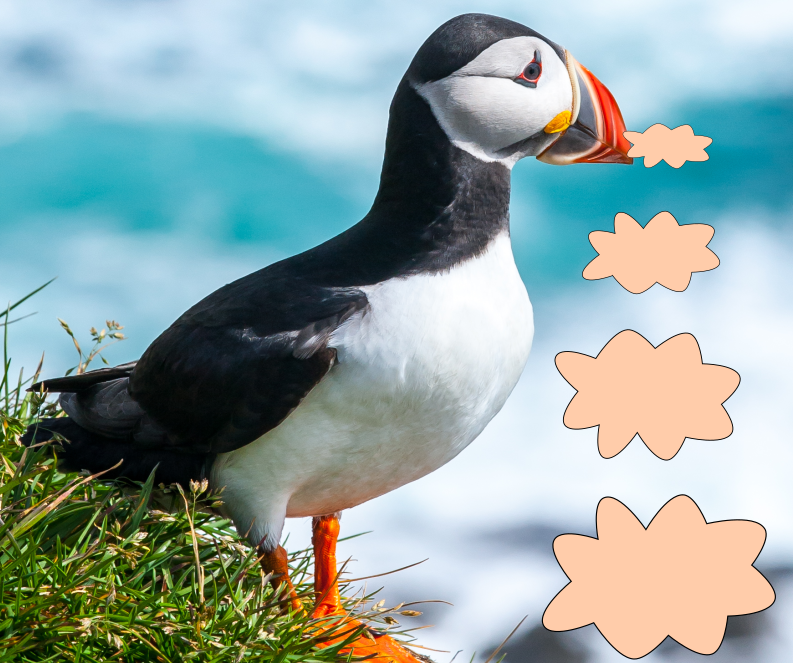

## Le macareux moine

Le macareux moine
Fatercula artica

### apparence physique

La hauteur du macareux moine varie entre 28 et 30 cm. Lorsqu’il a les ailes deployées sa longueur varie entre 50 et 60 cm. Il pèse entre 320g et 550g.
Le macareux moine a un corps rondelet et une grande tete. Il a un bec massif et coloré donc orange, jaune et gris. Cet oiseau a des ailes courtes une queue courte et des pattes courtes et palmées. Son plumage sont noir et blanches. 

### Mode de vie

Le macareux moine est repartie en Atlantique du Nord en Europe et en Russie. Les macareux moine sont une éspèce c’est a dire qu’elle vit principalement en mer et ne revient sur terre que pour la periode de la nidification. Ils sont carnivores (ils mangent de la viande) et piscivores (ils se nourrissent de poissons). Le macareux moine se nourrit principalement de poissons de crustacés et de mollusques. Les macareux moine sont gregaires (ils vivent en groupes). Leur age maximum est entre 20 et 25 ans.

### Diminution de la population

Les macareux moines sont classes vulnerables (VU) au niveau mondial et en danger d’extinction (EN) au niveu europeen. En France metropolitaine il n’y a que des macareux moine en Bretagne ou ils sont 100 a 300 “adultes”. Si on inclut egalement les territoires d’outre-mer il y a au moins 20 000 individus.La cause de cette diminution est liée a la pollution des mers donc par exemple le petrole ou le plastique mais il y a d’autres exemples. La diminution de la population des macareux moines  est aussi liee a la diminution de leur nourriture due a la peche et enfin a la pollution lumineuse qui touche nottement les petits qui sont donc attires vers la lumière et se perdent.Le macareux moine est l’emblème de la Ligue de Protection des Oiseaux
ou un couple de ces oiseaux est representé.

